  
  <h1>Hi, my name is Alex</h1>
  
I build practical software and keep learning in public.

  
  

### About Me

*   🌍 I'm based in Uzhhorod, Ukraine
*   🧠 I'm learning practical AI tooling to build better products
*   🤝 Open to connecting around clean web products and practical tooling

### Skills

  
  
  
  
  
  
  
  
  
  
  
  

### Socials

  <a href="https://github.com/alex-andreiev" target="_blank" rel="noreferrer">
    <picture>
      <source media="(prefers-color-scheme: dark)" srcset="https://raw.githubusercontent.com/danielcranney/readme-generator/main/public/icons/socials/github-dark.svg" />
      <source media="(prefers-color-scheme: light)" srcset="https://raw.githubusercontent.com/danielcranney/readme-generator/main/public/icons/socials/github.svg" />
      
    </picture>
  </a>
  <a href="https://www.linkedin.com/in/alex-andreiev/" target="_blank" rel="noreferrer">
    <picture>
      <source media="(prefers-color-scheme: dark)" srcset="https://raw.githubusercontent.com/danielcranney/readme-generator/main/public/icons/socials/linkedin-dark.svg" />
      <source media="(prefers-color-scheme: light)" srcset="https://raw.githubusercontent.com/danielcranney/readme-generator/main/public/icons/socials/linkedin.svg" />
      
    </picture>
  </a>

### Badges

<b>My GitHub Stats</b>

